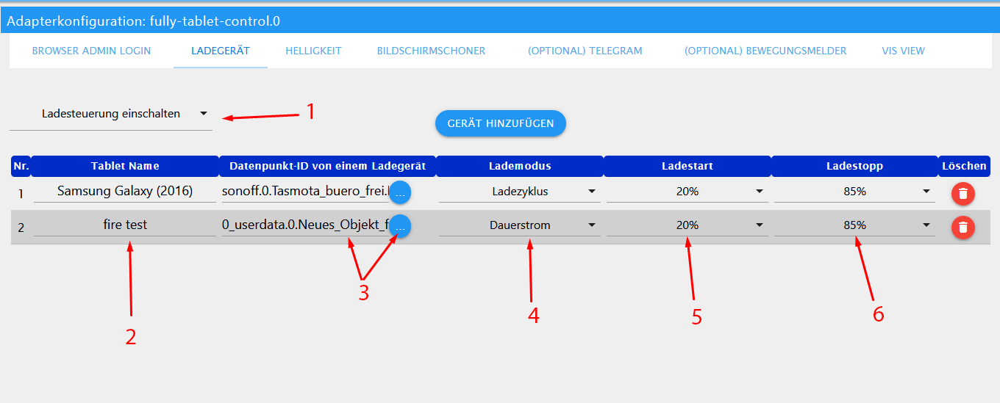

---

# This control sidebar index

index: 3

# This is the icon of the page

icon: article

# This is the title of the article

title: Ladegerät

# Set author

author: xXBJXx

# Set writing time

date: 2022-05-24

# A page can have multiple categories

category:

- Fully Tablet Control

# A page can have multiple tags

tag:

- Fully Tablet Control

# The page’s sidebar heading rendering depth.

headerDepth: 2
---

## Ladegerät

Hier muss die ID von dem Ladegerät eingetragen werden damit das Tablet geladen werden kann.

1. Ladesteuerung Einschalten oder ausschalten, wenn ausgeschaltet ignoriert der Adapter alles, was mit dem Laden des
   Tablets zu tun hat es werden, auch keine Warnungen bei schwacher Batterie ausgegeben.

2. Nicht Ausfüllen wird automatisch nach einem reload ausgefüllt.

3. Datenpunkt ID (aus den Iobroker Objekten entweder reinkopieren oder per button auswählen) von dem Ladegerät das ein
   und ausgeschaltet werden soll.

4. Lademodus auswählbar sind **Dauerstrom** oder **Ladezyklus** bei beiden muss die **ID eingetragen sein** bei
   Dauerstrom wird das Tablet dauerhaft am Strom gehalten und bei Ladezyklus wird das Tablet z.B. bei 20 % anfangen
   zu laden und bei 85 % das Laden abschalten. \
   Bei der Auswahl **aus** wird die Ladesteuerung für dieses Tablet ausgeschaltet es muss auch keine **ID** eingetragen
   werden.
   

5. **(nur für Ladezyklus relevant)** Ladestart ab dieser Wert startet das Tablet das laden.

6. **(nur für Ladezyklus relevant)** Ladestopp bis zu den diesen Wert wird das Tablet aufgeladen.
