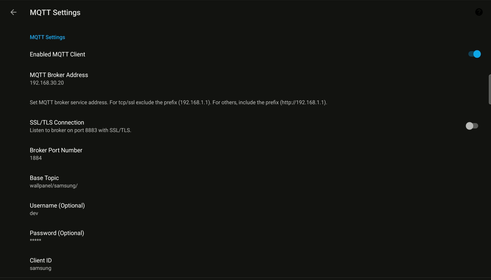

---

# This control sidebar index

index: 2

# This is the icon of the page

icon: article

# This is the title of the article

title: MQTT settings

# Set author

author: xXBJXx

# Set writing time

date: 2022-05-25

# A page can have multiple categories

category:

- Wallpanel

# A page can have multiple tags

tag:

- Wallpanel

# The page’s sidebar heading rendering depth.

headerDepth: 1
---

## Settings preview

Here is a small preview of what you can set.

## MQTT main settings

If you want to use the MQTT connection from the app, you need to enable it first, as it is disabled by default.

* MQTT Client: Here, the MQTT connection is enabled or disabled.
* MQTT Broker Adresse: Here the MQTT broker address is entered like ioBroker MQTT Broker/Client
  (ioBroker ip Adresse)
* Broker Port: Here the MQTT broker port is entered (Default Port
  1883)
* Base Topic: The Base Topic is entered here,
  e.g. <Badge text="wallpanel/samsung/" type="tip" vertical="middle"/>

  ::: warning Important
  The Base Topic must be followed by a slash <Badge text="/" type="danger" vertical="middle"/> end. e.g. <Badge text="wallpanel/samsung/" type="tip" vertical="middle"/> 
  otherwise, the data points are not created correctly in ioBroker, e.g. <Badge text="samsungbattery" type="danger" vertical="middle"/> What  
  actually <Badge text="samsung.battery" type="tip" vertical="middle"/> should be. 
   
  In the adapter, you need the last <Badge text="/" type="danger" vertical="middle"/> not to be specified.
  :::

* Username(Optional):  The Username is
  entered here, e.g. <Badge text="iobroker" type="info" vertical="middle"/> But this is optional, if you want to set it, you have to enter it in the MQTT adapter as well.
* Password(Optional): Here the password
  of your choice is entered like e.g. <Badge text="12345" type="info" vertical="middle"/> But this is optional, if you want to set it, you have to enter it in the MQTT adapter as
  well.
* Client ID: Here the client ID entered, like <Badge text="samsung hallway" type="tip" vertical="middle" />
  this is not relevant, it is only shown in the MQTT adapter which clients connect.

