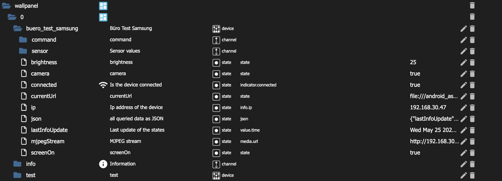
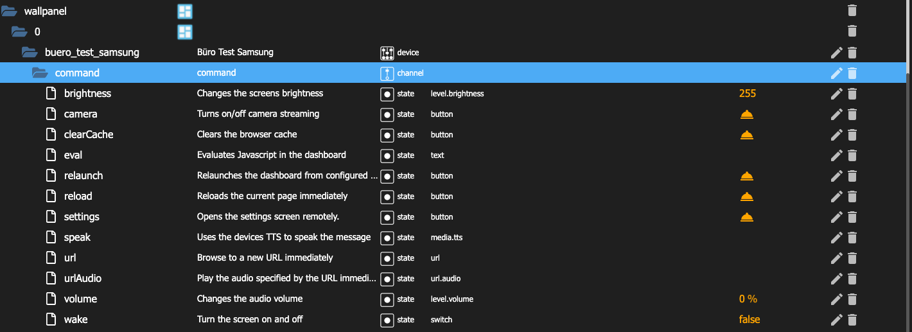

---

# This control sidebar index

index: 3

# This is the icon of the page

icon: article

# This is the title of the article

title: Data points overview

# Set author

author: xXBJXx

# Set writing time

date: 2022-05-25

# A page can have multiple categories

category:

- Wallpanel

# A page can have multiple tags

tag:

- Wallpanel

# The page’s sidebar heading rendering depth.

headerDepth: 2
---

## State overview

Here I'll show you an overview of the different states that the wallpanel object tree offers.
I'll start with the default states, which are for display only.


* <span style="color:#cf3424; fontSize:1.1em; font-weight:bold">brightness</span>: Here, the brightness value of the device displayed from 0 to 255.
* <span style="color:#cf3424; fontSize:1.1em; font-weight:bold">camera</span>: This indicates whether the camera is active or not.
* <span style="color:#cf3424; fontSize:1.1em; font-weight:bold">connected</span>: Indicates whether the adapter connected to the app.
* <span style="color:#cf3424; fontSize:1.1em; font-weight:bold">currentUrl</span>: The URL that the browser is currently displaying is shown here.
* <span style="color:#cf3424; fontSize:1.1em; font-weight:bold">ip</span>: The IP address of the device displayed here.
* <span style="color:#cf3424; fontSize:1.1em; font-weight:bold">json</span>: All the data that the adapter collects from the tablet displayed here in a JSON object.
* <span style="color:#cf3424; fontSize:1.1em; font-weight:bold">lastInfoUpdate</span>: The time when the last update from the adapter made is displayed here.
* <span style="color:#cf3424; fontSize:1.1em; font-weight:bold">mjpegStream</span>: The MJPEG stream URL displayed here.<br>
  <span style="color:#ffa500">(</span> Requirement: MJPEG stream enabled in the app. <span style="color:#ffa500">)</span>
* <span style="color:#cf3424; fontSize:1.1em; font-weight:bold">screenOn</span>: Here it is displayed whether the screen is active or not.

## Command’s:

Under Command's all commands that the adapter can send to the Wallpanel App displayed.


* <span style="color:#cf3424; fontSize:1.1em; font-weight:bold">brightness</span>: Here, the brightness value of the device can be changed.
  <span style="color:#ffa500">(</span> 0 to 255 <span style="color:#ffa500">)</span>
* <span style="color:#cf3424; fontSize:1.1em; font-weight:bold">camera</span>: Here the camera can be activated that deactivated is not possible from the adapter. The state is
  therefore a button.
* <span style="color:#cf3424; fontSize:1.1em; font-weight:bold">clearCache</span>: Here the cache of the device can be deleted.
* <span style="color:#cf3424; fontSize:1.1em; font-weight:bold">eval</span>: Here a script can be executed.

:::tip

  ```js 
  alert('Hello I am a JavaScript function');
  ```

When you run this, a window will appear on the screen, the text you gave in the function with will be displayed in the window.
:::

* <span style="color:#cf3424; fontSize:1.1em; font-weight:bold">relaunch</span>: Here, the current page setback to the home page of the browser.
* <span style="color:#cf3424; fontSize:1.1em; font-weight:bold">reload</span>: This reloads the current page.
* <span style="color:#cf3424; fontSize:1.1em; font-weight:bold">settings</span>: Here, the settings of the app opened in the browser.
* <span style="color:#cf3424; fontSize:1.1em; font-weight:bold">speak</span>: Here you can enter a text that will be spoken on the device.
* <span style="color:#cf3424; fontSize:1.1em; font-weight:bold">url</span>: You can enter a URL that will be loaded on the device.

::: tip
Small information to all, you can also start an app via the URL command, if this is installed on the tablet.
To this, you simply have to enter this link in the input of the URL, for example:

* Ring App:

``` 
intent:#Intent;launchFlags=0x10000000;component=com.ringapp/.ui.activities.LoginActivity;end 
```

* Calendar (Samsung)

``` 
  intent:#Intent;launchFlags=0x10000000;component=com.samsung.android.calendar/com.android.calendar.AllInOneActivity;end
```

[Hier](https://tinyurl.com/2qnqodkq) You can find more links, you just have to try what works for you.
:::

* <span style="color:#cf3424; fontSize:1.1em; font-weight:bold">urlAudio</span>: Here you can enter an audio URL that will be played on the device.
* <span style="color:#cf3424; fontSize:1.1em; font-weight:bold">volume</span>: Here, the volume value can be changed from 0% to 100%. <br> <span style="color:#ffa500">
  (</span> Has no effect on the TTS volume <span style="color:#ffa500">)</span>

  ::: warning Attention
  has had no effect in my tests.
  :::

* <span style="color:#cf3424; fontSize:1.1em; font-weight:bold">wake</span>: Turns the screen on or off.

  ::: warning Attention
  The screen, not turned off before Android's screen timeout finished
  :::

## MQTT states overview

Here are the states that can be queried by the MQTT adapter.

::: warning Attention
<span style="color:orange; font-size:1.5em; font-weight: bold" >MQTT Adapter must be installed and MQTT must be set up in
the. [Wallpanel App](/wallpanel/app/mqtt-settings)</span>
:::


::: warning Attention
Not all MQTT sensors are available on the different devices.
:::

### battery <span style="color:#ffa500">(</span>Battery<span style="color:#ffa500">)</span>

* <span style="color:#cf3424; fontSize:1.1em; font-weight:bold">acPlugged</span>: This indicates whether the device connected to the AC charger.
* <span style="color:#cf3424; fontSize:1.1em; font-weight:bold">battery</span>: The charging status of the device displayed here.
* <span style="color:#cf3424; fontSize:1.1em; font-weight:bold">charging</span>: This shows whether the device currently being charged.
* <span style="color:#cf3424; fontSize:1.1em; font-weight:bold">usbPlugged</span>: This shows whether the device connected to the USB charger.

### face <span style="color:#ffa500">(</span>Face detection<span style="color:#ffa500">)</span>

* <span style="color:#cf3424; fontSize:1.1em; font-weight:bold">face</span>: Shows whether the camera has detected a face.

### light <span style="color:#ffa500">(</span>Illuminance<span style="color:#ffa500">)</span>

* <span style="color:#cf3424; fontSize:1.1em; font-weight:bold">id</span>: The ID shows the device ID of the sensor.

* <span style="color:#cf3424; fontSize:1.1em; font-weight:bold">light</span>: This displays the current illuminance in lux.

### magneticField <span style="color:#ffa500">(</span>Magnetic field strength<span style="color:#ffa500">)</span>

* <span style="color:#cf3424; fontSize:1.1em; font-weight:bold">magneticField</span>: This displays the current magnetic field strength in µT.

### motion <span style="color:#ffa500">(</span>Motion detector<span style="color:#ffa500">)</span>

* <span style="color:#cf3424; fontSize:1.1em; font-weight:bold">motion</span>: Shows whether the camera has detected motion.

### qrCode <span style="color:#ffa500">(</span>QR Code<span style="color:#ffa500">)</span>

* <span style="color:#cf3424; fontSize:1.1em; font-weight:bold">qrCode</span>: The recognized QR code displayed here.

### pressure <span style="color:#ffa500">(</span>Air pressure<span style="color:#ffa500">)</span>

* <span style="color:#cf3424; fontSize:1.1em; font-weight:bold">pressure</span>: The current air pressure in hPa is displayed here.

### temperature <span style="color:#ffa500">(</span>Temperature<span style="color:#ffa500">)</span>

* <span style="color:#cf3424; fontSize:1.1em; font-weight:bold">temperature</span>: The current temperature in °C is displayed here.